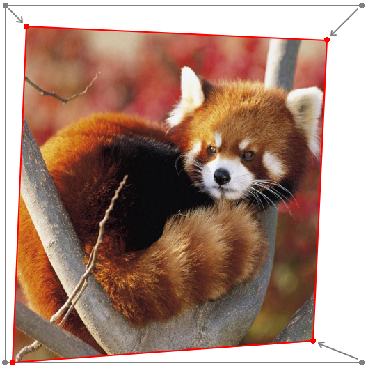

# perspective.js

[](https://github.com/wanadev/perspective.js) [](https://www.npmjs.com/package/perspectivejs) [](https://discord.gg/BmUkEdMuFp) [](https://github.com/wanadev/perspective.js/blob/master/LICENSE)

**perspective.js** is a JavaScript library which allow you to transform a
rectangle image into an arbitrary form of quadrilateral on a canvas element.
It is used to draw an image using perspective on a canvas.

This is a derivative work of the original Futomi Hatano's **perspective.js**
~~available on www.html5.jp~~ [still available on Internet Archive][pjs-archive].

[pjs-archive]: https://web.archive.org/web/20190810235509/http://www.html5.jp/test/perspective_canvas/demo1_en.html


## Install from NPM

    npm install perspectivejs


## Example usage

```javascript
    // ctx (CanvasRenderingContext2D): The 2D context of a HTML5 canvas element.
    // image (Image): The image to transform.
    var p = new Perspective(ctx, image);
    p.draw([
        [30, 30],                               // Top-left [x, y]
        [image.width - 50, 50],                 // Top-right [x, y]
        [image.width - 70, image.height - 30],  // bottom-right [x, y]
        [10, image.height]                      // bottom-left [x, y]
    ]);
```



See [demo/index.html](./demo/demo.html) for the complete example.


## See also

* [perspective.ts](https://github.com/adonmo/perspective.ts): A TypeScript version of this library.


## Building the dist files

To build the files of the `dist/` folder, just use the following command:

    npm install
    npx grunt


## Changelog

* **v1.0.3:** Use a clip path instead of a mask to avoid clearing the canvas (#9)
* **v1.0.2:** Documentation update (install from NPM, badges)
* **v1.0.1:** Documentation update
* **v1.0.0:** Initial release


## License

    Copyright 2010 futomi  http://www.html5.jp/

    Licensed under the Apache License, Version 2.0 (the "License");
    you may not use this file except in compliance with the License.
    You may obtain a copy of the License at

      http://www.apache.org/licenses/LICENSE-2.0

    Unless required by applicable law or agreed to in writing, software
    distributed under the License is distributed on an "AS IS" BASIS,
    WITHOUT WARRANTIES OR CONDITIONS OF ANY KIND, either express or implied.
    See the License for the specific language governing permissions and
    limitations under the License.
